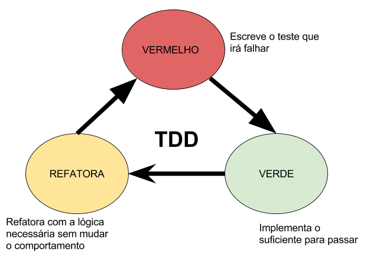
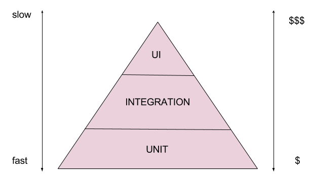
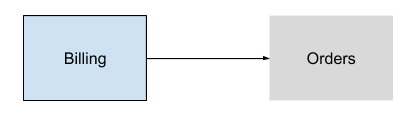
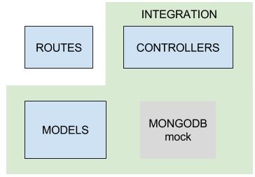
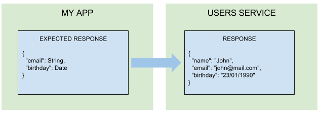

<!-- toc -->

- [Prefácio](#pref%C3%A1cio)
- [Para quem é esse livro](#para-quem-%C3%A9-esse-livro)
- [Introdução](#introdu%C3%A7%C3%A3o)
- [Introdução ao *Node.js*](#introdu%C3%A7%C3%A3o-ao-nodejs)
  * [O *Google V8*](#o-google-v8)
  * [Entendendo o *Node.js* *single thread*](#entendendo-o-nodejs-single-thread)
  * [*I/O* assíncrono não bloqueante](#io-ass%C3%ADncrono-n%C3%A3o-bloqueante)
  * [*Event Loop*](#event-loop)
  * [*Call Stack*](#call-stack)
  * [*Multi threading*](#multi-threading)
  * [*Task Queue*](#task-queue)
  * [*Micro* e *Macro Tasks*](#micro-e-macro-tasks)
    + [*Macro tasks*](#macro-tasks)
    + [*Micro tasks*](#micro-tasks)
- [Configurando o ambiente](#configurando-o-ambiente)
  * [O que é um transpiler](#o-que-%C3%A9-um-transpiler)
  * [Gerenciamento de projeto e dependências](#gerenciamento-de-projeto-e-depend%C3%AAncias)
- [Iniciando o projeto](#iniciando-o-projeto)
  * [Configuração inicial](#configura%C3%A7%C3%A3o-inicial)
  * [Configurando suporte ao *Ecmascript* 6](#configurando-suporte-ao-ecmascript-6)
  * [Configurando o servidor web](#configurando-o-servidor-web)
  * [Express Middlewares](#express-middlewares)
- [Desenvolvimento guiado por testes](#desenvolvimento-guiado-por-testes)
  * [Test Driven Development - TDD](#test-driven-development---tdd)
  * [Os ciclos do *TDD*](#os-ciclos-do-tdd)
    + [*Red*](#red)
    + [*Green*](#green)
    + [*Refactor*](#refactor)
  * [A piramide de testes](#a-piramide-de-testes)
  * [Os tipos de testes](#os-tipos-de-testes)
    + [Testes de unidade (*Unit tests*)](#testes-de-unidade-unit-tests)
    + [Testes de integração (*Integration tests*)](#testes-de-integra%C3%A7%C3%A3o-integration-tests)
    + [Teste de integração de contrato (*Integration contract tests*)](#teste-de-integra%C3%A7%C3%A3o-de-contrato-integration-contract-tests)
    + [A definição de um contrato](#a-defini%C3%A7%C3%A3o-de-um-contrato)
  * [*Test Doubles*](#test-doubles)
    + [*Fake*](#fake)
    + [*Spy*](#spy)
    + [*Stub*](#stub)
    + [*Mock*](#mock)
  * [O ambiente de testes em *javascript*](#o-ambiente-de-testes-em-javascript)
    + [*Test runners*](#test-runners)
    + [Bibliotecas de *Assert*](#bibliotecas-de-assert)
    + [Bibliotecas de suporte](#bibliotecas-de-suporte)
- [Configurando testes de integração](#configurando-testes-de-integra%C3%A7%C3%A3o)
  * [Instalando Mocha Chai e Supertest](#instalando-mocha-chai-e-supertest)
  * [Separando execução de configuração](#separando-execu%C3%A7%C3%A3o-de-configura%C3%A7%C3%A3o)
  * [Configurando os testes](#configurando-os-testes)
  * [Criando o primeiro caso de teste](#criando-o-primeiro-caso-de-teste)
  * [Executando os testes](#executando-os-testes)
  * [Fazendo os testes passarem](#fazendo-os-testes-passarem)
- [Estrutura de diretórios e arquivos](#estrutura-de-diret%C3%B3rios-e-arquivos)
  * [O diretório root](#o-diret%C3%B3rio-root)
  * [O que fica no diretório root?](#o-que-fica-no-diret%C3%B3rio-root)
  * [Separação da execução e aplicação](#separa%C3%A7%C3%A3o-da-execu%C3%A7%C3%A3o-e-aplica%C3%A7%C3%A3o)
  * [Dentro do diretório *source*](#dentro-do-diret%C3%B3rio-source)
  * [Responsabilidades diferentes dentro de um mesmo source](#responsabilidades-diferentes-dentro-de-um-mesmo-source)
  * [*Server* e *client* no mesmo repositório](#server-e-client-no-mesmo-reposit%C3%B3rio)
  * [Separação por funcionalidade](#separa%C3%A7%C3%A3o-por-funcionalidade)
  * [Conversão de nomes](#convers%C3%A3o-de-nomes)
- [Rotas com o *express router*](#rotas-com-o-express-router)
  * [Separando as rotas](#separando-as-rotas)
  * [Rotas por recurso](#rotas-por-recurso)
  * [*Router paths*](#router-paths)
  * [Executando os testes](#executando-os-testes-1)
- [*Controllers*](#controllers)
  * [Configurando os testes de unidade](#configurando-os-testes-de-unidade)
  * [Testando o *controller* unitariamente](#testando-o-controller-unitariamente)
  * [*Mocks, Stubs* e *Spies* com *Sinon.js*](#mocks-stubs-e-spies-com-sinonjs)
  * [Integrando controllers e rotas](#integrando-controllers-e-rotas)
- [Configurando o *MongoDB* como banco de dados](#configurando-o-mongodb-como-banco-de-dados)
  * [Introdução ao MongoDB](#introdu%C3%A7%C3%A3o-ao-mongodb)
  * [Configurando o banco de dados com *Mongoose*](#configurando-o-banco-de-dados-com-mongoose)
  * [Integrando o *Mongoose* com a aplicação](#integrando-o-mongoose-com-a-aplica%C3%A7%C3%A3o)
  * [Alterando a inicilização](#alterando-a-iniciliza%C3%A7%C3%A3o)

<!-- tocstop -->

# Prefácio

em breve.
# Para quem é esse livro

em breve.
# Introdução

em breve.
# Introdução ao *Node.js*

A primeira coisa que se deve entender quando se fala de *Node.js* é o que exatamente ele é. *Node.js* não é uma linguagem de programação nem tampouco um *framework*. A definição mais apropriada seria um ambiente de *runtime* para *javascript* que roda em cima de uma *engine* conhecida como *Google v8*.
O *Node.js* nasceu de uma ideia do *Ryan Dahl* que buscava uma solução para o problema de acompanhar o progresso de *upload* de arquivos sem ter que fazer pooling no servidor. Em 2009 na *JSConf EU* ele apresenta o *Node.js* a comunidade, e introduz o *javascript server side* com *I/O* não bloqueante, ganhando assim o interesse da comunidade que começou a contribuir com o projeto desde a versão 0.x.

A primeira versão do *NPM* (*Node Package Manager*), gerenciador de pacotes oficial, foi lançada em 2011 permitindo aos desenvolvedores a criação e publicação de suas próprias bibliotecas e ferramentas. O *npm* é tão importante quanto o próprio *Node.js* sendo um fator chave para o sucesso do mesmo.

Nessa época não era fácil usar o *Node*, com a fomentação em torno da tecnologia a frequência em que *breaking changes* aconteciam quase impossibilitava o desenvolvimento. O cenário se estabilizou com o lançamento da versão 0.8, que se manteve com baixo número de *breaking changes*.
Mesmo com a frequência de atualizações a comunidade se manteve ativa, *frameworks* como *Express* e *Socker.IO* já estavam em desenvolvimento desde 2010 e acompanharam, lado a lado, as versões da tecnologia.

O crescimento do *Node.js* foi rápido e teve altos e baixos como a saída do *Ryan Dahl* em 2012 e a separação dos *commiters* do *Node.js* em 2014, infelizes com a administração da *Joyent* (empresa na qual Ryan trabalhava antes de sair do projeto) eles decidiram fazer um *fork* do projeto e chama-lo de *IO.js* com a intenção de prover releases mais rápidas e acompanhando as melhorias do *Google V8*.

Essa separação trouxe dor de cabeça a comunidade que não sabia qual dos projetos deveria usar. Então, a *Joyent* e outras grandes empresas como *IBM, Paypal e Microsoft* decidiram trabalhar juntas para ajudar a comunidade *Node.js* criando a [*Node.js Foundation*](https://nodejs.org/en/foundation/) que tem como missão uma administração transparente e o encorajamento da participação da comunidade. Com isso, os projetos *Node.js* e *IO.js* se uniram, e com a fusão foi lançada a primeira versão estável do *Node.js*, a versão 4.0.

## O *Google V8*

O *V8* é uma *engine* criada pela *Google* para ser usada no *browser chrome*. Em 2008 a *Google*  tornou o *V8 open source* e passou a chamá-lo de *Chromium project*. Essa mudança possibilitou que a comunidade entendesse a *engine* em sí, além de compreender como o *javascript* é interpretado e compilado pela mesma.

O *javascript* é uma linguagem interpretada, o que o coloca em desvantagem quando comparado com linguagens compiladas, pois cada linha de código precisa ser interpretada enquanto o código é executado. O *V8* compila o código para linguagem de máquina, além de otimizar drasticamente a execução usando heurísticas, permitindo que a execução seja feita em cima do código compilado e não interpretado.  

## Entendendo o *Node.js* *single thread*

A primeira vista o modelo *single thread* parece não fazer sentido, qual seria a vantagem de limitar a execução da aplicação em somente uma *thread*? Linguagens como *Java*, *PHP* e *Ruby* seguem um modelo onde cada nova requisição roda em uma *thread* separada do sistema operacional. Esse modelo é eficiente mas tem um custo de recursos muito alto, nem sempre é necessário todo o recurso computacional aplicado para executar uma nova *thread*. 
O *Node.js* foi criado para solucionar esse problema, usar programação assíncrona e recursos compartilhados para tirar maior proveito de uma *thread*.

O cenário mais comum é um servidor *web* que recebe milhões de requisições por segundo; Se o servidor iniciar uma nova *thread* para cada requisição vai gerar um alto custo de recursos e cada vez mais será necessário adicionar novos servidores para suportar a demanda. O modelo assíncrono *single thread* consegue processar mais requisições concorrentes do que o exemplo anterior, com um número bem menor de recursos. 

Ser *single thread* não significa que o *Node.js* não usa *threads* internamente, para entender mais sobre essa parte devemos primeiro entender o conceito de *I/O* assíncrono não bloqueante.

## *I/O* assíncrono não bloqueante

Essa talvez seja a característica mais poderosa do *Node.js*, trabalhar de forma não bloqueante facilita a execução paralela e o aproveitamento de recursos. 
Para entender melhor, vamos pensar em um exemplo comum do dia a dia. Imagine que temos uma função que realiza várias ações, como por exemplo: uma operação matemática, ler um arquivo de disco, e transformar o resultado em uma *String*. Em linguagens bloqueantes como *PHP*, *Ruby* e etc, cada ação será executada apenas depois que a ação anterior for encerrada, no exemplo citado a ação de transformar a *String* terá que esperar uma ação de ler um arquivo de disco, que pode ser uma operação pesada, certo?
Vamos ver um exemplo de forma síncrona, ou seja, bloqueante:

```javascript
const fs = require('fs');
let fileContent;
const someMath = 1+1;


try {
  fileContent = fs.readFileSync('big-file.txt', 'utf-8');
  console.log('file has been read');
} catch (err) {
  console.log(err);
}


const text = `The sum is ${ someMath }`;
console.log(text);
```

Nesse exemplo, a última linha de código com o ***console.log*** terá que esperar a função ***readFileSync*** do module de *file system* executar, mesmo não possuindo ligação alguma com o resultado da leitura do arquivo. 

Esse é o problema que o *Node.js* se propôs a resolver, possibilitar que ações não dependentes entre sí sejam desbloqueadas. Para solucionar isso o *Node.js* depende de uma funcionalidade chamada *high order functions* que basicamente possibilitam  passar uma função por parâmetro para outra função, assim como uma variável, as funções passadas como parâmetro serão executadas posteriormente, como no exemplo a seguir:

```javascript
const fs = require('fs');

const someMatch = 1+1;

fs.readFile('big-file.txt', 'utf-8', function (err, content) {
    if (err) {
    return console.log(err)
    }
    console.log(content)
})

const text = `The response is ${ someMatch }`;
console.log(text);
```

No exemplo acima usamos a função ***readFile*** do módulo *file system*, assíncrona por padrão. Para que seja possível executar alguma ação quando a função terminar de ler o arquivo é necessário passar uma função por parâmetro, essa função será chamada automaticamente quando a função *readFile* finalizar a leitura.
Funções passadas por parâmetro para serem chamadas quando a ação é finalizada são chamadas de *callbacks*. No exemplo acima o *callback* recebe dois parâmetros injetados automaticamente pelo *readFile*: *err*, que em caso de erro na execução irá possibilitar  o tratamento do erro dentro do *callback*, e content que é a resposta da leitura do arquivo.

Para entender como o *Node.js* faz para ter sucesso com o modelo assíncrono é necessário entender também o *Event Loop*.

## *Event Loop*

O *Node.js* é guiado por eventos, termo também conhecido como *Event Driven*, esse conceito já é bastante aplicado em interações com interface de usuário. O *javascript* possui diversas *APIs* baseadas em eventos para interações com o *DOM* por exemplo, eventos como *onClick*, *onHide*, *onShow* são muito comuns no mundo *front-end* com *javascript*.

*Event driven* é um fluxo de controle determinado por eventos ou alterações de estado, a maioria das implementações possuem um ***core*** (central) que escuta todos os eventos e chama seus respectivos *callbacks* quando eles são lançados (ou tem seu estado alterado). Esse basicamente é o resumo do *Event Loop* do *Node.js*.

Separadamente a responsabilidade do *Event Loop* parece simples, mas quando nos aprofundamos para entender como o *Node.js* trabalha, notamos que o *Event Loop* é a peça chave para o sucesso do modelo *event driven*. Nos tópicos seguintes iremos entender cada um dos componentes que formam o ambiente do *Node.js*, como eles funcionam e como se conectam.

## *Call Stack*

A *stack* (pilha) é um conceito bem comum no mundo das linguagens de programação, frequentemente se ouve algo do tipo: "Estourou a pilha!". No *Node.js* e no *javascript* em geral esse conceito não se difere muito de outras linguagens, sempre que uma função é executada ela entra na *stack*, que executa somente uma coisa por vez, ou seja, o código posterior ao que está rodando precisa esperar a função atual terminar de executar para seguir adiante.
Vamos ver um exemplo:

```javascript
function generateBornDateFromAge(age) {
  return 2016 - age;
}

function generateUserDescription(name, surName, age) {
  const fullName = name + " " + surName;
  const bornDate = generateBornDateFromAge(age);

  return fullName + " is " + age + " old and was born in " + bornDate;
}

generateUserDescription("Waldemar", "Neto", 26);
```

Para quem já é familiarizado com *javascript* não ha nada especial acontecendo aqui. Basicamente, a função ***generateUserDescription*** é chamada recebendo nome, sobrenome e idade de um usuário e retorna uma sentença com as informações colhidas. A função *generateUserDescription* depende da função ***generateBornDateFromAge*** para calcular o ano que o usuário nasceu, essa dependência será perfeita para entendermos como a *stack* funciona.


No momento que a função *generateUserInformation* é invocada ela vai depender da função *generateBornDateFromAge* para descobrir o ano em que o usuário nasceu com base no parâmetro age (idade). Quando a função *generateBornDateFromAge* for invocada pela função *generateUserInformation* ela será adicionada a *stack* como no exemplo a seguir:


Conforme a função *generateUserInformation* vai sendo interpretada, os valores vão sendo atribuídos às respectivas variáveis dentro de seu escopo, como no exemplo do *fullName*. Para atribuir o valor a variável *bornDate* foi necessário invocar a função *generateBornDateFromAge* que quando invocada ela é imediatamente adicionada a *stack* até que a execução termine e a resposta seja retornada.
Após o retorno a *stack* ficará assim:


O último passo da função será concatenar as variáveis e criar uma frase, isso não irá adicionar mais nada a *stack*. Quando a função *generateUserInformation* terminar as demais linhas serão interpretadas, no nosso exemplo será o ***console.log*** imprimindo a variável *userInformation*.


Como a *stack* só executa uma tarefa por vez foi necessário esperar que a função anterior executasse e finalizasse, para que o *console.log* pudesse ser adicionado a *stack*.
Entendendo o funcionamento da *stack* podemos concluir que funções que precisam de muito tempo para execução irão ocupar mais tempo na *stack* e assim impedir a chamada das próximas linhas.

## *Multi threading*

Mas o *Node.js* não é *single thread*? Essa é a pergunta que os desenvolvedores *Node.js* provavelmente mais escutam. Na verdade quem é *single thread* é o *V8*, motor do *google* utilizado para rodar o *Node.js*. A *stack* que vimos no capitulo anterior faz parte do *V8*, ou seja, ela é *single thread*.
Para que seja possível executar tarefas assíncronas o *Node.js* conta com diversas outras *APIs*, algumas delas providas pelos próprios sistemas operacionais, como é o caso de eventos de disco, *sockets TCP* e *UDP*. Quem toma conta dessa parte de *I/O* assíncrono, de administrar múltiplas *threads* e enviar notificações é a ***libuv***.

A [*libuv*](https://github.com/libuv/libuv) é uma biblioteca *open source* multiplataforma escrita em *C*, criada inicialmente para o *Node.js* e hoje usada por diversos outros projetos como [*Julia*](http://julialang.org/) e [*Luvit*](https://luvit.io/).

O exemplo a seguir mostra uma função assíncrona sendo executada:


Nesse exemplo a função ***readFile*** do módulo de *file system* do *Node.js* é executada na *stack* e jogada para uma *thread*, a *stack* segue executando as próximas funções enquanto a função *readFile* está sendo administrada pela *libuv* em outra *thread*. Quando ela terminar o *callback* sera adicionado a uma fila chamada ***Task Queue*** para ser executado pela *stack* assim que ela estiver livre.


## *Task Queue*

Como vimos no capítulo anterior, algumas ações como *I/O* são enviadas para serem executadas em outra *thread* permitindo que o *V8* siga trabalhando e a *stack* siga executando as próximas funções. Essas funções enviadas para que sejam executadas em outra *thread* precisam de um *callback*. Um *callback* é basicamente uma função que será executada quando a função principal terminar.
Esses *callbacks* podem ter responsabilidades diversas, como por exemplo, chamar outras funções e executar alguma lógica.
Como o *V8* é *single thread* e só existe uma *stack*, os *callbacks* precisam esperar a sua vez de serem chamados. Enquanto esperam, os *callbacks* ficam em um lugar chamado *task queue* ou fila de tarefas. Sempre que a *thread* principal finalizar uma tarefa, o que significa que a *stack* estará vazia, uma nova tarefa é movida da *task queue* para a *stack* onde será executada.
Para entender melhor vamos ver a imagem abaixo:


Esse *loop*, conhecido como ***Event Loop***, é infinito e será responsável por chamar as próximas tarefas da *task queue* enquanto o *Node.js* estiver rodando.

## *Micro* e *Macro Tasks*

Até aqui vimos como funciona a *stack*, o *multithread* e também como são enfileirados os *callbacks* na *task queue*. Agora vamos conhecer os tipos de *tasks* (tarefas) que são enfileiradas na *task queue*, que podem ser *micro tasks* ou *macro tasks*.

### *Macro tasks*

Alguns exemplos conhecidos de *macro tasks* são: *setTimeout*, *I/O*, *setInterval*. Segundo a especificação do [*WHATWG*](https://html.spec.whatwg.org/multipage/webappapis.html#task-queue) somente uma *macro task* deve ser processada em um ciclo do *Event Loop*.

### *Micro tasks*

Alguns exemplos conhecidos de *micro tasks* são as *promises* e o *process.nextTick*. As *micro tasks* normalmente são tarefas que devem ser executadas rapidamente após alguma ação, ou realizar algo assíncrono sem a necessidade de inserir uma nova *task* na *task queue*.
A especificação do *WHATWG* diz que após o *Event Loop* processar a *macro task* da *task queue* todas as *micro tasks* disponíveis devem ser processadas e, caso elas chamem outras *micro tasks*, essas também devem ser resolvidas para que somente então ele chame a próxima *macro task*.

O exemplo abaixo demonstra como funciona esse fluxo:


# Configurando o ambiente
A configuração do ambiente é a base para todo o projeto. Nela é configurado o *transpiler*, no nosso caso, o ***Babel.js***, as configurações do ***NPM***, a estrutura base de diretórios e etc.
Durante todo o livro a versão usada do *Node.js* será a 6.9.1 *LTS* (*long term support*). Para que seja possível usar as funcionalidades mais atuais do *javascript* será usado o *Ecmascript* na versão 6 *ES6* (*ES2015* ou *javascript* 2015), aqui iremos chamar de *ES6*. 

Como a versão do *Node.js* que usaremos não dá suporte inteiramente ao *ES6* será necessário usar um *transpiler* para que seja possível utilizar 100% das funcionalidades do *ES6* e executar o projeto na versão que estamos usando.

## O que é um transpiler
*Transpilers* também são conhecidos como compiladores *source-to-source* ou seja, de código para código. Usando um *transpiler* é possível escrever código utilizando as funcionalidade do *ES6* ou versões mais novas e transformar o código em um código suportado pela versão do *Node.js* que estaremos usando, no caso a 6.x. Um dos *transpilers* mais conhecidos do universo *javascript* é o [***Babel.js***](). 
Criado em 2015 por Sebastian McKenzie, o *Babel* permite utilizar as últimas funcionalidades do *javascript* e ainda assim executar o código em *browser engines* que ainda não suportam elas nativamente como no caso do *v8* (*engine* do *chrome* na qual o *Node.js* roda), pois ele traduz para uma forma suportada.

## Gerenciamento de projeto e dependências
Quase todas as linguagens possuem um gerenciador, tanto para automatizar tarefas, *build*, executar testes quanto gerenciar dependencias. O *javascript* possui uma gama de gerenciadores, como o [*Grunt*](), *Gulp* e *Brocoli* para gerenciar e automatizar tarefas, o *Bower* para gerenciar dependencias de projetos *front-end*. Para o ambiente *Node.js* é necessário um gerenciador que também permita a automatização de tarefas e customização de *scripts*.

Nesse cenário entra o [*npm*](http://) (*Node Package Manager*), criado por Isaac Z. Schlueter o *npm* foi adotado pelo *Node.js* e já vem embutido nele. O *npm registry* armazena mais de 400,000 pacotes públicos e privados de milhares de desenvolvedores e empresas possibilitando a divisão e contribuição de pacotes entre a comunidade *javascript*. 
 O cliente do *npm* (interface de linha de comando) permite utilizar o *npm* para criar projetos, automatizar tarefas e gerenciar dependencias.


# Iniciando o projeto

Para iniciar um projeto em *Node.js* a primeira coisa a fazer é inicializar o *npm* no diretório onde ficará a aplicação. Para fazer isso primeiro certifique de ter instalados o *Node.js* e o *npm* em seu computador, caso ainda não tenha eles instalados vá até o site do *Node.js* e faça o download https://nodejs.org/en/download/. Ele irá instalar junto também o *npm*.

## Configuração inicial
Crie um diretório onde ficará sua aplicação, após isso, dentro do diretório execute o seguinte comando:

```sh 
$ npm init
```

Semelhante ao *git* o *npm* inicializará um novo projeto nesse diretório, depois de executar o comando o *npm* realizará algumas perguntas (nem uma delas precisa ser respondida agora, podem ficar em branco, basta apertar enter) como:

1. **name**, referente ao nome do projeto.
2. **version**, referente a versão.
3. **description**, referente a descrição do projeto que está sendo criado.
4. **entry point**, arquivo que será o ponto de entrada caso o projeto seja importado por outro. 
5. **test command**, comando que executara os testes de aplicação. 
6. **git repository**, repositório git do projeto.
7. **keywords**, palavras chave para ajudar outros desenvolvedores a achar seu projeto no *npm*.
8. **author**, autor do projeto.
9. **license** referente a licença de uso do código.
Após isso um arquivo chamado **package.json** será criado e receberemos uma saída semelhante a essa:

```json
{
  "name": "node-book",
    "version": "1.0.0",
    "description": "",
    "main": "index.js",
    "scripts": {
      "test": "echo \"Error: no test specified\" && exit 1"
    },
    "author": "",
    "license": "ISC"
}
```

O **package.json** é responsavel por guardar as configurações *npm* do nosso projeto, nele ficarão nossos *scripts* para executar a aplicação e os testes.

## Configurando suporte ao *Ecmascript* 6 
Como vimos anteriormente o *Babel* sera responsável por nos permitir usar as funcionalidades do *ES6*, para isso precisamos instalar os pacotes e configurar o nosso ambiente para suportar o *ES6* por padrão em nossa aplicação.
O primeiro passo é instalar os pacotes do *Babel*:

```sh
$ npm install --save-dev babel-cli
```

Após instalar o *Babel* é necessário instalar o *preset* que será usado, no nosso caso é o *ES6*:
```sh
$ npm install --save-dev babel-preset-node6
```

Note que sempre usamos *--save-dev* para instalar dependências referentes ao *Babel* pois ele não deve ser usado diretamente em produção, para produção iremos compilar o código, veremos isso mais adiante.

O último passo é informar para o *Babel* qual *preset* iremos usar, para isso basta criar um arquivo no diretório raiz da nossa aplicação chamado **.babelrc** com as seguintes configurações:

```json
{
  "presets": ["node6"]
}
```

Feito isso a aplicação já esta suportando 100% o *ES6* e sera possivel usar todas as funcionalidades da versão.
O código dessa parte está disponivel [neste link](https://github.com/waldemarnt/building-testable-apis-with-nodejs-code/tree/step1).

## Configurando o servidor web
Como iremos desenvolver uma aplicação *web* precisaremos de um servidor que nos ajude a trabalhar com requisições *HTTP*, transporte de dados, rotas e etc. Dentre muitas opções no universo *Node.js* como o [*Sails.js*](), [*Hapi.js*]() e [*Koa.js*]() iremos optar pelo [*Express.js*]() por possuir um bom tempo de atividade, muito conteúdo na comunidade e ser mantido pela [*Node Foundation*]().

O *Express* é um *framework* para desenvolvimento *web* para *Node.js* inspirado no *Sinatra* desenvolvido para o *ruby on rails*. Criado por TJ Holowaychuk o *Express* foi adquirido pela [*StrongLoop*]() em 2014 e é administrado atualmente pela *Node.js Foundation*.
Iremos instalar dois modulos, o *express* e o *body-parser*:

```sh
$ npm install --save express body-parser
```

Quando uma requisição do tipo *POST* ou *PUT* é realizada seu corpo é transportado como texto, para que seja possível transportar dados como *JSON* (*JavaScript Object Notation*) por exemplo existe o modulo [*body-parser*]() que é um conjunto de *middlewares* para o *express* que analisa o corpo de uma requisição e transforma em algo definido, no nosso caso, em *JSON*.

Agora iremos criar um arquivo chamado **server.js** no diretório *root* e nele iremos fazer a configuração básica do *express*:

```javascript
import express from 'express';
import bodyParser from 'body-parser';

const app = express();
app.use(bodyParser.json());

app.get('/', (req, res) => res.send('Hello World!'));

app.listen(3000, () => {
    console.log('Example app listening on port 3000!');
});
```

A primeira coisa feita no arquivo é a importação dos módulos *express* e *body-parser*, após isso uma nova instância do express é criada e associada a constante *app*. Para utilizar o *body-parser* é necessário configurar o *express* para usar o *middleware*, o *express* possui um método chamado *use* onde é possível passar *middlewares* como parâmetro, no código acima foi passado o **bodyParser.json()** responsavel por transformar o corpo das requisições em *JSON*.

A seguir é criado uma rota, os verbos *HTTP* como *GET*, *POST*, *PUT*, *DELETE* são funções no *express* que recebem como parâmetro um padrão de rota, no caso acima **"/"**, e uma função que será chamada quando a rota receber uma requisição. Os parametros **req** e **res** representam *request* (requisição) e *response* (resposta ) e serão injetados automaticamente pelo express quando a requisição for recebida.
Para finalizar, a função **listen** é chamada recebendo um número referente a porta na qual a aplicação ficará exposta, no nosso caso, 3000.

O último passo é configurar o *package.json* para iniciar nossa aplicação, para isso vamos adicionar um *script* de *start* dentro do objeto *scripts*:

```json
"scripts": {
  "start": "babel-node ./server.js",
  "test": "echo \"Error: no test specified\" && exit 1"
},
```

Alterado o *package.json* basta executar o comando: 

```sh
$ npm start
```

Agora a aplicação estará disponível em **http://localhost:3000/**.
O código dessa parte está disponivel [neste link](https://github.com/waldemarnt/building-testable-apis-with-nodejs-code/tree/step2).

## Express Middlewares 

*Middlewares* são funções que tem acesso aos objetos: requisição (*request*), resposta (*response*), e o próximo *middleware* que será chamado, normalmente nomeado como *next*.
Essas funções são executadas antes da lógica da rota, dessa maneira é possível transformar os objetos de requisição e resposta, realizar validações, autenticações e até mesmo terminar a requisição antes que ela execute e lógica escrita na rota. 
O exemplo a seguir mostra uma aplicação *express* simples com uma rota que devolve um *"Hello world"* quando chamada, nela sera adicionado um *middleware*.

```javascript
const express = require('express');
const app = express();

app.get('/', function (req, res) {
  res.send('Hello World!');
});

app.listen(3000);
```

*Middlewares* são apenas funções que recebem os parâmetros requisição (*req*), resposta (*res*) e próximo (*next*) executam alguma lógica e chamam o próximo *middleware*, caso não tenha, chamam a função da rota.
No exemplo abaixo é criado um *middleware* que vai escrever *"LOGGED"* no terminal.

```javascript
const myLogger = function (req, res, next) {
  console.log('LOGGED');
  next();
};
```

Para que o *express* use essa função é necessário passar por parâmetro para a função use:

```javascript
const express = require('express');
const app = express();

const myLogger = function (req, res, next) {
  console.log('LOGGED');
  next();
};

app.use(myLogger);

app.get('/', function (req, res) {
  res.send('Hello World!');
});

app.listen(3000);
```

Dessa maneira a cada requisição para qualquer rota o *middleware* sera invocado e ira escrever *"LOGGED"* no terminal.
*Middlewares* também podem ser invocados em uma rota específica:

```javascript
const express = require('express');
const app = express();

const myLogger = function (req, res, next) {
  console.log('LOGGED');
  next();
};

app.get('/', myLogger, function (req, res) {
  res.send('Hello World!');
});

app.listen(3000);
```

Esse comportamento é muito útil e ajuda a não duplicar código, iremos ver mais sobre os *middlewares* ao decorrer do livro.

# Desenvolvimento guiado por testes

Agora que vamos começar a desenvolver nossa aplicação, precisamos garantir que a responsabilidade, as possíveis rotas, as requisições e as respostas estão sendo atendidas; que estamos entregando o que prometemos e que está tudo funcionando. Para isso, vamos seguir um modelo conhecido como *TDD* (*Test Driven Development* ou Desenvolvimento Guiado por Testes).

## Test Driven Development - TDD
O *TDD* é um processo de desenvolvimento de *software* que visa o *feedback* rápido e garantia de que o comportamento da aplicação está cumprindo o que é requerido. Para isso, o processo funciona em ciclos pequenos e os requerimentos são escritos como casos de teste.

A prática do *TDD* aumentou depois que *Kent Beck* publicou o livro [*TDD - Test Driven Development*](https://www.amazon.com/Test-Driven-Development-Kent-Beck/dp/0321146530) e fomentou a discussão. Grandes figuras da comunidade ágil como *Martin Fowler* também influenciaram na adoção dessa prática publicando artigos, palestras e cases de sucesso.

## Os ciclos do *TDD*

Quando desenvolvemos guiados por testes, o teste acaba se tornando uma consequência do processo, ja que vai ser ele que vai determinar o comportamento esperado da implementação. Para que seja possível validar todas as etapas, o *TDD* se divide em ciclos que seguem um padrão conhecido como: ***Red***, ***Green***, ***Refactor***. 

### *Red*

Significa escrever o teste antes da funcionalidade e executá-lo, nesse momento como a funcionalidade ainda não foi implementada o teste deve quebrar, pois se não, há algo errado nele, essa fase também serve para verificar se não há erros na sintaxe e na semântica. 

### *Green*

Refere-se a etapa em que a funcionalidade é adicionada para que o teste passe. Nesse momento não é necessário ter a lógica definida, mas é importante atender os requerimentos do teste. Aqui podem ser deixados *to-dos*, dados estáticos, *fixmes*, ou seja, o suficiente para o teste passar.

### *Refactor*

É onde se aplica a lógica necessária e como o teste já foi validado nos passos anteriores ele garantirá que a funcionalidade está sendo implementada corretamente. Nesse momento devem ser removidos os dados estáticos além de coisas adicionadas somente para que o teste passasse, e ser feita a implementação real até que o teste volte a passar.
A imagem abaixo representa o ciclo do *TDD*:



## A piramide de testes

A pirâmide de testes é um conceito criado por *Mike Cohn*, escritor do livro [*Succeeding with Agile*](https://www.amazon.com/Succeeding-Agile-Software-Development-Using/dp/0321579364). O livro propõe que hajam mais testes de baixo nível, ou seja: testes de unidade, depois testes de integração e, no topo, testes que envolvem interface.



O autor observa que os testes de interface são custosos, para alguns testes é necessário inclusive licença de *softwares* que permitam a gravação dos passos e depois a execução do *playback* para ter a resposta do teste. Apesar de valioso, esse tipo de teste necessita de todo o ambiente para rodar e tende a demorar muito tempo.
O que *Mike* defende é ter a base do desenvolvimento com uma grande cobertura de testes de unidade; no segundo nível, garantir a integração entre os serviços e componentes com testes de integração, sem precisar envolver a interface do usuário. E no topo, possuir testes que envolvam o fluxo completo de interação com a *UI*, para validar todo o fluxo.

Vale lembrar que testes de unidade e integração podem ser feitos em qualquer parte da aplicação, tanto no lado do servidor quanto no lado do cliente, isso elimina a necessidade de ter testes complexos envolvendo todo o fluxo.

## Os tipos de testes

Atualmente contamos com uma variada gama de testes, sempre em crescimento de acordo com o surgimento de novas necessidades. Os mais comuns são os teste de unidade e integração, os quais iremos focar aqui.

### Testes de unidade (*Unit tests*)

Testes de unidade são a base da pirâmide de testes e possivelmente os mais comuns, ainda assim existem muitas pessoas que confundem o termo e as responsabilidades do mesmo. Segundo [*Martin Fowler*](http://martinfowler.com/bliki/UnitTest.html) , testes unitários são de baixo nível, com foco em pequenas partes do software e tendem a ser mais rapidamente executados quando comparados com outros testes, pois, testam partes isoladas. 

O primeiro ponto que deve ficar claro é: o que é uma unidade afinal? Esse conceito é divergente e pode variar de projeto, linguagem, time e paradigma de programação. Linguagens orientadas a objeto tendem a ter classes como uma unidade, já linguagens procedurais ou funcionais consideram normalmente funções como sendo uma unidade. Essa definição é algo muito relativo e depende do contexto e do acordo dos desenvolvedores envolvidos no processo. Nada impede que um grupo de classes relacionadas entre sí ou funções, sejam uma unidade.

No fundo, o que define uma unidade é o comportamento e a facilidade de ser isolada das suas dependências (dependências podem ser classes ou funções que tenham algum tipo de interação com a unidade).
Digamos que, por exemplo, decidimos que as nossas unidade serão as classes e estamos testando uma função da classe *Billing* que depende de uma função da classe *Orders*. A imagem abaixo mostra a dependência:


Para testar unitariamente é necessário isolar a classe *Billing* da sua dependência, a classe *Orders*, como na imagem a seguir:



Esse isolamento pode ser feito de diversas maneiras, por exemplo utilizando *mocks*, *stubs*, *spys* ou qualquer outra técnica de substituição de dependência e comportamento. O importante é que seja possível isolar a unidade e ter o comportamento esperado da dependência.

### Testes de integração (*Integration tests*)

Testes de integração servem para verificar se a comunicação entre os componentes de um sistema está funcionando conforme o esperado. Diferente dos testes de unidade, onde a unidade é isolada de duas dependências, no teste de integração deve ser testado o comportamento da interação entre as unidades. 
Não há um nível de granularidade específico, a integração pode ser testada em qualquer nível, seja a interação entre camadas, classes ou até mesmo serviços. 

No exemplo a seguir temos uma arquitetura comum de aplicações *Node.js* e desejamos testar a integração entre as rotas, *controllers*, *models* e banco de dados:


Nossa integração pode ser desde a rota até salvar no banco de dados (nesse caso, *MongoDB*), dessa maneira é possível validar todo o fluxo até o dado ser salvo no banco, como na imagem a seguir:


Esse teste é imprescindível mas custoso. Será necessário limpar o banco de dados a cada teste e criar os dados novamente, além de custar tempo e depender de um serviço externo como o *MongoDB*. Um grau de interação desse nível terá vários possíveis casos de teste, como por exemplo o usuário mandou um dado errado e deve receber um erro de validação, para esses tipos de cenário, às vezes é melhor diminuir a granularidade do teste para que seja possível ter mais casos de teste.
Para um caso onde o *controller* chama o *model* passando dados inválidos e a válidação deve emitir um erro, poderíamos testar a integração entre o *controller* e o *model*, como no exemplo a seguir:


Nesse exemplo todos os componentes do sistema são facilmente desacopláveis, podem haver casos onde o *model* depende diretamente do banco de dados e como queremos apenas testar a validação não precisamos inserir nada no banco, nesse caso é possível substituir o banco de dados ou qualquer outra dependência por um *mock* ou *stub* para reproduzir o comportamento de um banco de dados sem realmente chamar o banco.



### Teste de integração de contrato (*Integration contract tests*)

Testes de contrato ganharam muita força devido ao crescimento das *APIs* e dos micro serviços. Normalmente, quando testamos a nossa aplicação, mesmo com o teste de integração, tendemos a não usar os serviços externos e sim um substituto que devolve a resposta esperada. Isso por que serviços externos podem afetar no tempo de resposta da requisição, podem cair, aumentar o custo e isso pode afetar nossos testes.
Mas por outro lado, quando isolamos nossa aplicação dos outros serviços para testar ficamos sem garantia de que esses serviços não mudaram suas *APIs*, que a resposta esperada ainda é a mesma, para solucionar esses problemas existem os testes de contrato.

### A definição de um contrato

Sempre que consumimos um serviço externo dependemos de alguma parte dele ou de todos os dados que ele provém e o serviço se compromete a entregar esses dados. O exemplo abaixo mostra um teste de contrato entre a aplicação e um serviço externo, nele é verificado se o contrato entre os dois ainda se mantém o mesmo.



É importante notar que o contrato varia de acordo com a necessidade, nesse exemplo a nossa aplicação depende apenas dos campos *email* e *birthday* então o contrato formado entre eles verifica apenas isso. Se o *name* mudar ele não quebrará nossa aplicação nem o contrato que foi firmado.
Em testes de contrato o importante é o tipo e não o valor. No exemplo verificamos se o *email* ainda é *String* e se o campo *birthday* ainda é do tipo *Date*, dessa maneira garantimos que a nossa aplicação não vai quebrar. O exemplo a seguir mostra um contrato quebrado onde o campo *birthday* virou *born*, ou seja, o serviço externo mudou o nome do campo, nesse momento o contrato deve quebrar.


Testes de contrato possuem diversas extensões, o caso acima é chamado de *consumer contract* onde o consumidor verifica o contrato e, caso o teste falhe, notifica o *provider* (provedor) ou altera sua aplicação para o novo contrato. Também existe o *provider contracts* onde o próprio provedor testa se as alterações feitas irão quebrar os consumidores.

## *Test Doubles*

Testar código com *ajax*, *network*, *timeouts*, banco de dados e outras dependências que produzem efeitos colaterais é sempre complicado. Por exemplo, quando se usa *ajax*, ou qualquer outro tipo de *networking*, é necessário comunicar com um servidor que irá responder para a requisição; já com o banco de dados será necessário inicializar um serviço para tornar possível o teste da aplicação: limpar e criar tabelas para executar os testes e etc.

Quando as unidades que estão sendo testadas possuem dependências que produzem efeitos colaterais, como os exemplos acima, não temos garantia de que a unidade está sendo testada isoladamente. Isso abre espaço para que o teste quebre por motivos não vinculados a unidade em sí, como por exemplo o serviço de banco não estar disponível ou uma *API* externa retornar uma resposta diferente da esperada no teste.

Há alguns anos atrás Gerard Meszaros publicou  o livro *XUnit Test Patterns: Refactoring Test Code* e introduziu o termo *Test Double* (traduzido como “dublê de testes”) que nomeia as diferentes maneiras de substituir dependências. A seguir vamos conhecer os mais comuns test doubles e quais são suas características, prós e contras.

Para facilitar a explicação será utilizado o mesmo exemplo para os diferentes tipos de *test doubles*, também será usada uma biblioteca de suporte chamada [*Sinon.js*](http://sinonjs.org/) que possibilita a utilização de *stubs*, *mocks* e *spies*. 

A *controller* abaixo é uma classe que recebe um banco de dados como dependência no construtor. O método que iremos testar unitariamente dessa classe é o método ***"getAll"***, ele retorna uma consulta do banco de dados com uma lista de usuários.

```javascript
const Database = {
  findAll() {}
}

class UsersController {
  constructor(Database) {
    this.Database = Database;
  }

  getAll() {
    return this.Database.findAll('users');
  }
}
```

### *Fake*

Durante o teste, é frequente a necessidade de substituir uma dependência para que ela retorne algo específico, independente de como for chamada, com quais parâmetros, quantas vezes, a resposta sempre deve ser a mesma. Nesse momento a melhor escolha são os *Fakes*. *Fakes* podem ser classes, objetos ou funções que possuem uma resposta fixa independente da maneira que forem chamadas. O exemplo abaixo mostra como testar a classe *UsersController* usando um *fake*:

```javascript
describe('UsersController getAll()', () => {
  it('should return a list of users', () => {
    const expectedDatabaseResponse = [{
      id: 1,
      name: 'John Doe',
      email: 'john@mail.com'
    }];

    const fakeDatabase = {
      findAll() {
        return expectedDatabaseResponse;
      }
    }
    const usersController = new UsersController(fakeDatabase);
    const response = usersController.getAll();

    expect(response).to.be.eql(expectedDatabaseResponse);
  });
});
```
Nesse caso de teste não é necessária nenhuma biblioteca de suporte, tudo é feito apenas criando um objeto fake para substituir a dependência do banco de dados. O método ***"findAll"*** passa a ter uma resposta fixa, que é uma lista com um usuário.
Para validar o teste é necessário verificar se a resposta do método *"getAll"* do *controller* responde com uma lista igual a declarada no *"expectedDatabaseResponse"*.

Vantagens:

- Simples de escrever
- Não necessita de bibliotecas de suporte
- Desacoplado da dependencia original

Desvantagens:

- Não possibilita testar múltiplos casos
- Só é possível testar se a saída está como esperado, não é possível validar o comportamento interno da unidade

Quando usar *fakes*:

*Fakes* devem ser usados para testar dependências que não possuem muitos comportamentos.

### *Spy*

Como vimos anteriormente os *fakes* permitem substituir uma dependência por algo customizado mas não possibilitam saber, por exemplo, quantas vezes uma função foi chamada, quais parâmetros ela recebeu e etc. Para isso existem os *spies*, como o próprio nome já diz, eles gravam informações sobre o comportamento do que está sendo “espionado”.
No exemplo abaixo é adicionado um *spy* no método *"findAll"* do *Database* para verificar se ele está sendo chamado com os parâmetros corretos:

```javascript
describe('UsersController getAll()', () => {
  it('should database findAll with correct parameters', () => {
    const findAll = sinon.spy(Database, 'findAll');

    const usersController = new UsersController(Database);
    usersController.getAll();

    sinon.assert.calledWith(findAll, 'users');
    findAll.restore();
  });
});
```

Note que é adicionado um *spy* na função ***"findAll"*** do *Database*, dessa maneira o *Sinon* devolve uma referência a essa função e também adiciona alguns comportamentos a ela que possibilitam realizar checagens como *"sinon.assert.calledWith(findAll, 'users')"* onde é verificado se a função foi chamada com o parâmetro esperado.

Vantagens:

- Permite melhor assertividade no teste
- Permite verificar comportamentos internos
- Permite integração com dependências reais

Desvantagens:

- Não permitem alterar o comportamento de uma dependência
- Não é possível verificar múltiplos comportamentos ao mesmo tempo

Quando usar *spies*:

*Spies* podem ser usados sempre que for necessário ter assertividade de uma dependência real ou, como em nosso caso, em um *fake*. Para casos onde é necessário ter muitos comportamos é provável que *stubs* e *mocks* venham melhor a calhar.

### *Stub*

*Fakes* e *spies* são simples e substituem uma dependência real com facilidade, como visto anteriormente, porém, quando é necessário representar mais de um cenário para a mesma dependência eles podem não dar conta. Para esse cenário entram na jogada os *Stubs*. *Stubs* são *spies* que conseguem mudar o comportamento dependendo da maneira em que forem chamados, veja o exemplo abaixo:

```javascript
describe('UsersController getAll()', () => {
  it('should return a list of users', () => {
    const expectedDatabaseResponse = [{
      id: 1,
      name: 'John Doe',
      email: 'john@mail.com'
    }];

    const findAll = sinon.stub(Database, 'findAll');
    findAll.withArgs('users').returns(expectedDatabaseResponse);

    const usersController = new UsersController(Database);
    const response = usersController.getAll();

    sinon.assert.calledWith(findAll, 'users');
    expect(response).to.be.eql(expectedDatabaseResponse);
    findAll.restore();
  });
});
```

Quando usamos *stubs* podemos descrever o comportamento esperado, como nessa parte do código: 

```javascript
findAll.withArgs('users').returns(expectedDatabaseResponse);
```
Quando a função *"findAll"* for chamada com o parâmetro *"users"*, retorna a resposta padrão. 

Com *stubs* é possível ter vários comportamentos para a mesma função com base nos parâmetros que são passados, essa é uma das maiores diferenças entre *stubs* e *spies*.

Como dito anteriormente, *stubs* são *spies* que conseguem alterar o comportamento. É possível notar isso na asserção *"sinon.assert.calledWith(findAll, 'users')"* ela é a mesma asserção do *spy* anterior. Nesse teste são feitas duas asserções, apenas para mostrar a semelhança com *spies*, pois múltiplas asserções em um mesmo caso de teste é considerado uma má prática.

Vantagens:

- Comportamento isolado
- Diversos comportamentos para uma mesma função
- Bom para testar código assíncrono

Desvantagens:

- Assim como spies não é possível fazer múltiplas verificações de comportamento

Quando usar *stubs*:

*Stubs* são perfeitos para utilizar quando a unidade tem uma dependência complexa, que possui múltiplos comportamentos. Além de serem totalmente isolados os stubs também tem o comportamento de *spies* o que permite verificar os mais diferentes tipos de comportamento.

### *Mock*

*Mocks* e *stubs* são comumente confundidos pois ambos conseguem alterar comportamento e também armazenar informações. *Mocks* também podem ofuscar a necessidade de usar *stubs* pois eles podem fazer tudo que *stubs* fazem. O ponto de grande diferença entre *mocks* e *stubs* é sua responsabilidade: *stubs* tem a responsabilidade de se comportar de uma maneira que possibilite testar diversos caminhos do código, como por exemplo uma resposta de uma requisição *http* ou uma exceção; Já os *mocks* substituem uma dependência permitindo a verificação de múltiplos comportamentos ao mesmo tempo.
O exemplo a seguir mostra a classe *UsersController* sendo testada utilizando *Mock*:

```javascript
describe('UsersController getAll()', () => {
  it('should call database with correct arguments', () => {
    const databaseMock = sinon.mock(Database);
    databaseMock.expects('findAll').once().withArgs('users');

    const usersController = new UsersController(Database);
    usersController.getAll();

    databaseMock.verify();
    databaseMock.restore();
  });
});
```
A primeira coisa a se notar no código é a maneira de fazer asserções com *Mocks*, elas são descritas nessa parte: 

```javascript
databaseMock.expects('findAll').once().withArgs('users');
```

Nela são feitas duas asserções, a primeira para verificar se o método *"findAll"* foi chamado uma vez e na segunda se ele foi chamado com o argumento *"users"*, após isso o código é executado e é chamada a função *"verify()"* do *Mock* que irá verificar se as expectativas foram atingidas.

Vantagens:

- Verficicação interna de comportamento
- Diversos asserções ao mesmo tempo

Desvantagens:

- Diversas asserções ao mesmo tempo podem tornar o teste difícil de entender.

Quando usar *mocks*:

*Mocks* são úteis quando é necessário verificar múltiplos comportamentos de uma dependência. Isso também pode ser sinal de um *design* de código mal pensado, onde a unidade tem muita responsabilidade. É necessário ter muito cuidado ao usar *Mocks* já que eles podem tornar os testes pouco legíveis.


## O ambiente de testes em *javascript*

Diferente de muitas linguagens que contam com ferramentas de teste de forma nativa ou possuem algum *xUnit (JUnit, PHPUnit, etc)* no *javascript* temos todos os componentes das suites de testes separados, o que nos permite escolher a melhor combinação para a nossa necessidade (mas também pode criar confusão).
Em primeiro lugar precisamos conhecer os componentes que fazem parte de uma suíte de testes em *javascript*:

### *Test runners* 

*Test runners* são responsáveis por importar os arquivos de testes e executar os casos de teste. Eles esperam que cada caso de teste devolva *true* ou *false*. Alguns dos test runners mais conhecidos de *javascript* são o [*Mocha*](https://mochajs.org/) e o [*Karma*](https://karma-runner.github.io/1.0/index.html).

### Bibliotecas de *Assert*

Alguns *test runners* possuem bibliotecas de *assert* por padrão, mas é bem comum usar uma externa. Bibliotecas de *assert* verificam se o teste está cumprindo com o determinado fazendo a afirmação e respondendo com *true* ou *false* para o *runner*. Algumas das bibliotecas mais conhecidas são o [*chai*](http://chaijs.com/) e o [*assert*](https://nodejs.org/api/assert.html).

### Bibliotecas de suporte

Somente rodar os arquivos de teste e fazer o assert nem sempre basta, é necessário substituir dependências, subir servidores *fake*, alterar o *DOM* e várias outras coisas. Para isso existem as bibliotecas de suporte, elas se separam em diversas responsabilidades como por exemplo para fazer *mocks* e *spys* temos o [*SinonJS*](http://sinonjs.org/) e o [*TestDoubleJS*](http://sinonjs.org/). Já para emular servidores existe o [*supertest*](http://sinonjs.org/).

# Configurando testes de integração

Iremos testar de fora para dentro, ou seja, começaremos pelos testes de integração e depois testes de unidade.  
Para começar vamos instalar as ferramentas de testes com o comando abaixo:

## Instalando Mocha Chai e Supertest

```sh
$ npm install --save-dev mocha chai supertest
```

Iremos instalar três módulos, que são:

* *Mocha*: módulo que ira executar as suites de teste. 
* *Chai*: módulo usado para fazer asserções.
* *Supertest*: módulo usado para emular e abstrair requisições *http*.

## Separando execução de configuração

Após isso será necessário alterar a estrutura de diretórios da nossa aplicação atual, criando um diretório chamado ***src***, lugar onde ficará o código fonte. Dentro dele iremos criar um arquivo chamado ***app.js*** que terá a responsabilidade de iniciar o *express* e carregar os *middlewares*. Ele ficará assim:

```javascript
import express from 'express';
import bodyParser from 'body-parser';

const app = express();
app.use(bodyParser.json());

app.get('/', (req, res) => res.send('Hello World!'));

export default app;
```

Aqui copiamos o código do *server.js* e removemos a parte do *app.listen* a qual iniciava a aplicação e adicionamos o ***export default app*** para exportar o *app* como um módulo.  
Agora precisamos alterar o *server.js* no diretório root para utilizar o *app.js*, vamos altera-lo para que ele fica dessa forma:

```javascript
import app from './src/app';
const port = 3000;

app.listen(port, () => {
  console.log(`app running on port ${port}`);
});
```

Note que agora separamos a responsabilidade de inicializar o *express* e carregar os *middlewares* da parte de iniciar a aplicação em si. Como nos testes a aplicação será inicializada pelo *supertest* e não pelo *express* como é feito no *server.js*, esse separação torna isso fácil.

## Configurando os testes

Agora que aplicação está pronta para ser testada, vamos configurar os testes. A primeira coisa a fazer é criar o diretório ***test*** no *root*, e dentro dele o diretório onde ficarão os testes de integração, vamos chamar esse diretório de ***integration***.  
A estrutura de diretórios ficará assim:

```sh
├── package.json
├── server.js
├── src
│   └── app.js
└── test
    └── integration
```

Dentro de *integration* iremos criar os arquivos de configuração para os testes de integração. O primeiro será referente as configurações do *Mocha*, vamos criar um arquivo chamado ***mocha.opts*** dentro do diretório *integration* com o seguinte código:

```
--require test/integration/helpers.js
--reporter spec
--compilers js:babel-core/register
--slow 5000
```

O primeiro *require* será o arquivo referente as configurações de suporte para os testes, o qual criaremos a seguir. Na linha seguinte definimos qual será o *reporter*, nesse caso, o [*spec*](https://mochajs.org/#spec). *Reporters* definem o estilo da saida do teste no terminal.  
Na terceira linha definimos os *compilers*, como iremos usar *Ecmascript6* também nos testes usaremos o *compiler* do *babel* no *Mocha*. E na última linha o *slow* referente a demora máxima que um caso de teste pode durar, como testes de integração tendem a depender de agentes externos como banco de dados e etc, é necessário ter um tempo maior de *slow* para eles.

O próximo arquivo que iremos criar nesse mesmo diretório é o ***helpers.js***. Ele tera o seguinte código:

```javascript
import supertest from 'supertest';
import chai from 'chai';
import app from '../../src/app.js';

global.app = app;
global.request = supertest(app);
global.expect = chai.expect;
```

O arquivo *helpers* é responsável por inicializar as configurações de testes que serão usadas em todos os testes de integração, removendo a necessidade de ter de realizar configurações em cada caso de teste.

Primeiro importamos os módulos necessários para executar os testes de integração que são o *supertest* e o *chai* e também a nossa aplicação *express* que chamamos de *app*.  
Depois definimos as globais usando **global**. Globais fazem parte do *Mocha*, tudo que for definido como global poderá ser acessado sem a necessidade de ser importado.  
No nosso arquivo *helpers* configuramos o *app* para ser global, ou seja, caso seja necessário usar ele em um caso de teste basta chama-lo diretamente. Também definimos um global chamado ***request*** que é o *supertest* que recebe o nosso *express* por parâmetro.  
Lembram que falei da vantagem de separar a execução da aplicação da configuração do *express*? Agora o *express* pode ser executado por um emulador como o *supertest*.  
E por ultimo o *expect* do *Chai* que sera usado para fazer as asserções nos casos de teste. 

## Criando o primeiro caso de teste

Com as configurações finalizadas agora nos resta criar nosso primeiro caso de teste. Vamos criar um diretório chamado ***routes*** dentro de *integration* e nele iremos criar o arquivo ***products_spec.js*** onde ficará o nosso teste referente as rotas do recurso *products* da nossa *API*.  
A estrutura de diretórios deve estar assim:

```sh
├── package.json
├── server.js
├── src
│   └── app.js
└── test
    └── integration
        ├── helpers.js
        ├── mocha.opts
        └── routes
            └── products_spec.js
```

Agora precisamos escrever nosso caso de teste, vamos começar com o seguinte código no arquivo ***products_spec.js***:

```javascript
describe('Routes: Products', () => {
  
});
```

O ***describe*** é uma global do *Mocha* usada para descrever suites de testes que contém um ou mais casos de testes ou também outras suítes de testes. Como esse é o *describe* que irá englobar todos os testes desse arquivo seu texto descreve a responsabilidade geral da suite de testes, que é testar a rota *products*.  
Agora vamos adicionar um produto padrão para os nossos testes:

```javascript
describe('Routes: Products', () => {
  const defaultProduct = {
    name: 'Default product',
    description: 'product description',
    price: 100
  };
});
```

Como a maioria dos testes precisará de um produto tanto para inserir quanto para verificar nas buscas, criamos uma constante chamada ***defaultProduct*** para ser reusada pelos casos de teste.  
O próximo passo é descrever a nossa primeira suíte de testes:

```javascript
describe('Routes: Products', () => {
  const defaultProduct = {
    name: 'Default product',
    description: 'product description',
    price: 100
  };

  describe('GET /products', () => {
    it('should return a list of products', done => {


    });
  });
});
```

Adicionamos mais um *describe* para deixar claro que todas as suites de teste dentro dele fazem parte do método *http GET* na rota */products*. Isso facilita a legibilidade do teste e deixa a saída do terminal mais clara.

A função ***it*** também é uma global do *Mocha* e tem a responsabilidade de descrever um caso de teste.  
Descrições de casos de teste seguem um padrão declarativo, como no exemplo acima: *"Isso deve retornar uma lista de produtos"*.  
Note que também é passado um parâmetro chamado *done* para o caso de teste, isso porque testes que executam funções assíncronas como requisições *http* precisam informar ao *Mocha* quando o teste finalizou, e fazem isso chamando a função *done*.  
Veremos isso na implementação a seguir:

```javascript
describe('Routes: Products', () => {
  const defaultProduct = {
    name: 'Default product',
    description: 'product description',
    price: 100
  };


  describe('GET /products', () => {
    it('should return a list of products', done => {


      request
      .get('/products')
      .end((err, res) => {
        expect(res.body[0]).to.eql(defaultProduct);
        done(err);
      });
    });
  });
});
```

Na implementação do teste usamos o *supertest* que exportamos globalmente como ***request*** no *helpers.js* ele nos permite fazer uma requisição *http* para uma determinada rota e verificar a sua resposta.  
Quando a requisição terminar a função *end* será chamada pelo *supertest*  recebendo erro , caso ocorra, e a resposta. Assim podemos fazer as asserções do nosso teste, no exemplo acima é verificado se o primeiro elemento da lista de produtos retornada é igual ao nosso *defaultProduct*.  
O *expect* usado para fazer a asserção faz parte do *Chai* e foi exposto globalmente no *helpers.js*.  
Para finalizar notificamos o *Mocha* que o teste finalizou chamando o *done* que recebe *err* como parâmetro, caso erro não seja nulo ele irá mostrar a mensagem de erro no terminal.

## Executando os testes

Escrito nosso teste, iremos executá-lo. Para automatizar a execução vamos adicionar a seguinte linha no ***package.json*** dentro de *scripts*:

```json
"test:integration": "NODE_ENV=test mocha --opts test/integration/mocha.opts test/integration/**/*_spec.js"
```

Nela é adicionado uma variável de ambiente como *test*, que além de boa prática também nos será útil logo, seguido das configurações do *Mocha*.

Para executar os testes agora basta executar o seguinte comando no terminal dentro do diretório *root* da aplicação:

```sh
$ npm run test:integration
```

A saida deve ser a seguinte:

```sh
Routes: Products
    GET /products
      1) should return a list of products


  0 passing (172ms)
  1 failing


  1) Routes: Products GET /products should return a list of products:
     Uncaught AssertionError: expected undefined to deeply equal { Object (name, description, ...) }

```

Ou seja, o teste está implementado corretamente, sem erros de sintaxe por exemplo, mas está falhando pois ainda não temos esse comportamento na aplicação, esse é o passo ***RED*** do *TDD* que vimos anteriormente.

## Fazendo os testes passarem

Escrevemos nossos testes e eles estão no estado ***RED*** ou seja, implementados mas não estão passando. O próximo passo segundo o *TDD* é o ***GREEN*** que significa implementar o mínimo para fazer o teste passar.  
Para fazer isso, precisamos implementar uma rota na nossa aplicação que suporte o método *http GET* e retorne uma lista com no mínimo um produto igual ao nosso *defaultProduct* do teste. 
Vamos alterar o arquivo *app.js* e adicionar a seguinte rota:

```javascript
app.get('/products', (req, res) => res.send([{
  name: 'Default product',
  description: 'product description',
  price: 100
}]));
```

Como vimos no capitulo sobre os *middlewares* do *express*, os objetos de requisição (***req***) e resposta (***res***) são injetados automaticamente pelo *express* nas rotas. No caso acima usamos o método *send* do objeto de resposta para enviar uma lista com um produto como resposta da requisição, o que deve ser suficiente para que nosso teste passe.  
Com as alterações o *app.js* deve estar assim:

```javascript
import express from 'express';
import bodyParser from 'body-parser';

const app = express();
app.use(bodyParser.json());

app.get('/', (req, res) => res.send('Hello World!'));
app.get('/products', (req, res) => res.send([{
  name: 'Default product',
  description: 'product description',
  price: 100
}]));

export default app;
```

Agora que já temos a implementação, vamos executar nosso teste novamente:

```sh
$ npm run test:integration
```

A saída deve ser de sucesso, como essa:

```sh
  Routes: Products
    GET /products
      ✓ should return a list of products


  1 passing (164ms)
```

Nosso teste está passando, e estamos no estado ***GREEN*** do *TDD*, ou seja, temos o teste e a implementação suficiente para ele passar. O próximo passo será o ***REFACTOR*** onde iremos configurar as rotas.

O código dessa parte está disponível [neste link](https://github.com/waldemarnt/building-testable-apis-with-nodejs-code/tree/step3).


# Estrutura de diretórios e arquivos
Um dos primeiros desafios quando começamos uma aplicação em *Node.js* é a estrutura do projeto. Uma das grandes conveniências do *Node*, por ser *javascript*, é a liberdade para estrutura, *design* de código, *patterns* e etc, mas isso também pode gerar confusão para os novos desenvolvedores.
A maioria dos projetos no *github* (https://github.com), por exemplo, possuem estruturas que diferem entre si, essa variação acontece pois cada desenvolvedor cria a estrutura da forma que se enquadrar melhor a sua necessidade.

Mesmo assim podemos aproveitar os padrões comuns entre esses projetos para estruturar nossa aplicação de maneira que atenda as nossas necessidades e também fique extensível, legível e facilmente integrável com ferramentas externas como *Travis*, *CodeClimate* e etc.
## O diretório root
O diretório *root* do projeto é o ponto de entrada, ou seja, a primeira impressão. No exemplo a seguir temos uma estrutura comum em aplicações usando o *framework* **Express.js**.

* controllers/
* middlewares/
* models/
* tests/
* .gitignore
* app.js
* package.json

Essa estrutura é legível e organizada, mas tende a ficar muito grande e misturar diretórios de código com diretórios de teste, *build* e etc, conforme o crescimento da aplicação. Um padrão comum em diversas linguagens é colocar o código da aplicação em um diretório *source* normalmente chamado *src*.

* src
    * controllers/
    * middlewares/
    * models/
* app.js
* tests/
* .gitignore
* server.js
* package.json

Dessa maneira o código da aplicação é isolado em um diretório deixando o *root* mais limpo e acabando com a mistura de diretórios de código com diretórios de testes e arquivos de configuração.

## O que fica no diretório root?
No exemplo acima movemos o código da aplicação para o diretório *src* mas ainda mantivemos o *tests*, o motivo disso é porque testes são executados ou por linha de comando ou por outras ferramentas. Inclusive os *test runners* como *mocha* e *karma* esperam que o diretório *tests* esteja no diretório principal. 
Outros diretórios comumente localizados no *root* são *scripts* de suporte ou *build*, exemplos, documentação e arquivos estáticos. No exemplo abaixo vamos incrementar nossa aplicação com mais alguns diretórios:
* env/
    * prod.env
    * dev.env
* public/
    * assets/
    * images/
    * css/
    * js/
* src
    * controllers/
    * middlewares/
    * models/
    * app.js
* tests/
* scripts/
    * deploy.sh
* .gitignore
* server.js
* package.json

O diretório *public* é responsável por guardar tudo aquilo que vai ser entregue para o usuário, usar ele no *root* facilita a criação de rotas de acesso e também movimentação dos assets caso necessário. Os diretórios *scripts* e *env* são relacionados a execução da aplicação e serão chamados por alguma linha de comando ou ferramenta externa, colocar eles em um diretório acessível facilita a usabilidade.

## Separação da execução e aplicação

No segundo passo, quando movemos o código para o diretório *src*, criamos um arquivo chamado **app.js** e mantemos o **server.js** no diretório *root*, dessa maneira deixamos o *server.js* com a responsabilidade de chamar o *app.js* e inicializar a aplicação. Assim isolamos a aplicação da execução e deixamos que ela seja executada por quem chamar, nesse caso o *server.js*, mas poderia ser um modulo como o *supertest* que vai fazer uma abstração *HTTP* para executar os testes e acessar as rotas.

## Dentro do diretório *source*
Agora que já entendemos o que fica fora do diretório *src* vamos ver como organizar ele baseado nas nossas necessidades.

* src/
    * controllers/
    * routes/
    * models/
    * middlewares/
    * app.js

Essa estrutura é bastante utilizada, ela é clara e separa as responsabilidades de cada componente, além de permitir o carregamento dinâmico.

## Responsabilidades diferentes dentro de um mesmo source 
As vezes quando começamos uma aplicação já sabemos o que será desacoplado e queremos dirigir nosso *design* para que no futuro seja possível separar e tornar parte do código um novo módulo. Outra necessidade comum é ter *APIs* específicas para diferentes tipos de clientes, como no exemplo a seguir:

* src/
    * mobile/
        * controllers/
        * routes/
        * models/
        * middlewares/
        * index.js
    * web
        * controllers/
        * routes/
        * models/
        * middlewares/
        * index.js
    * app.js

Esse cenário funciona bem mas pode dificultar o reuso de código entre os componentes, então, antes de usar, tenha certeza que seu caso de uso permite a separação dos clientes sem que um dependa do outro.

## *Server* e *client* no mesmo repositório
Muitas vezes temos o *backend* e *front-end* separados mas versionados juntos, no mesmo repositório, seja ele *git*, *mercurial*, ou qualquer outro controlador de versão. A estrutura mais comum que pude observar na comunidade para esse tipo de situação é separar o *server* e o *client* como no exemplo abaixo:

* client/
    * controllers/
    * models/
    * views/
* server/
    * controllers/
    * models/
    * routes/
* tests/
* config/
* package.json
* server.js
* client.js
* README.md

Essa estrutura é totalmente adaptável a necessidades. No exemplo acima, os testes de ambas aplicações estão no diretório *tests* no *root* assim se for adicionado o projeto em uma integração contínua ele vai executar a bateria de testes de ambas as aplicações. O **server.js** e o **client.js** são responsáveis por iniciar as respectivas aplicações, podemos ter um *npm start* no *package.json* que inicie os dois juntos.

## Separação por funcionalidade
Um padrão bem frequente é o que promove a separação por funcionalidade. Nele abstraimos os diretórios baseado nas funcionalidades e não nas responsabilidades, como no exemplo abaixo:

* src/
    * products/
        * products.controller.js
        * products.model.js
        * products.routes.js
    * orders/
        * orders.controller.js
        * orders.routes.js
    * app.js

Essa estrutura possui uma boa legibilidade e escalabilidade, mas por outro lado, pode crescer muito tornando o reuso de componentes limitado e dificultando o carregamento dinâmico de arquivos. 

## Conversão de nomes
Quando separamos os diretórios por suas responsabilidades pode não ser necessário deixar explícito a responsabilidade no nome do arquivo. Veja o exemplo abaixo:

* src/
    * controllers/
        * products.js
    * routes/ 
        * products.js


Como o nosso diretório é responsável por informar qual a responsabilidade dos arquivos que estão dentro dele, podemos nomear os arquivos sem adicionar o sufixo *“_”* + nome do diretório (por exemplo “_controller”). Além disso, o *javascript* permite nomear um módulo quando o importamos, permitindo que mesmo arquivos com o mesmo nome sejam facilmente distinguidos por quem está lendo o código, veja o exemplo:

```javascript
Import ProductsController from './src/controllers/products'; 
Import ProductsRoute from './src/routes/products'; 
```

Dessa maneira não adicionamos nenhuma informação desnecessária ao nomes dos arquivos e ainda mantemos a legibilidade do código.
# Rotas com o *express router*

O *express* possui um *middleware* nativo para lidar com rotas, o ***Router***.  O *Router* é responsável por administrar as rotas da aplicação e pode ser passado como parâmetro para o *app.use()*. Utilizando o *Router* é possível desacoplar as rotas, e também remover a necessidade de usar o *app* (instância do *express*) em outros lugares da aplicação.

## Separando as rotas

Vamos alterar nossa aplicação para separar as rodas do *app*. Para isso devemos criar um diretório chamado ***routes*** dentro de *src*. Os diretórios deverão ficar assim:

```shell
├── package.json
├── server.js
├── src
│   ├── app.js
│   └── routes
```

Dentro de *routes* criaremos um arquivo chamado *index.js*, ele será responsável por carregar todas as rotas da aplicação:

```javascript
import express from 'express';

const router = express.Router();

export default router;
```

No código acima importamos o *express* e acessamos o *Router* dentro dele e depois o exportamos.
Agora que temos um arquivo para administrar as rotas, vamos mover a lógica de administração das rotas que estão no *app.js* para o nosso *index.js*. Primeiro movemos a rota padrão. O arquivo de rotas deverá ficar assim:

```javascript
import express from 'express';

const router = express.Router();

router.get('/', (req, res) => res.send('Hello World!'));

export default router;
```

## Rotas por recurso

No código anterior não movemos a rota *products*, isso porque ela não ficará no *index.js*. Cada recurso da *api* terá seu próprio arquivo de rotas e o *index.js* ficará responsável por carregar todos eles.
Agora criaremos um arquivo para as rotas do recurso *products* da nossa *api*.

Para isso será necessário criar um arquivo chamado ***products.js*** dentro do diretório *routes*, ele terá o seguinte código:

```javascript
import express from 'express';

const router = express.Router();

export default router;
```

Agora podemos mover a rota *products* do *app.js* para o *products.js*. Ele deve ficar assim:

```javascript
import express from 'express';

const router = express.router();

router.get('/', (req, res) => res.send([{
  name: 'default product',
  description: 'product description',
  price: 100
}]));

export default router;
```

Note que agora o padrão da rota não é mais ***"/products"*** e somente **"/"** , isso é uma boa prática para separar recursos da *api*. Como nosso arquivo é *products.js* as rotas dentro dele serão referentes ao recurso *products* da *api*, por isso internamente não precisamos repetir esse prefixo. Deixaremos para o index carregar essa rota e dar o prefixo pra ela.
Vamos alterar o *index.js* para carregar a nossa nova rota, ele deve ficar assim:

```javascript
import express from 'express';
import productsRoute from './products';

const router = express.Router();

router.use('/products', productsRoute);
router.get('/', (req, res) => res.send('Hello World!'));

export default router;
```
Primeiro importamos a rota que foi criada anteriormente e damos o nome de ***productsRoute***, depois para carregar a rota chamamos a função *use* do *router* passando o prefixo da rota que será *"/products"** e o *productsRoute* que importamos.

Com as rotas configuradas o último passo é alterar o *app.js* para carregar nosso arquivo de rotas, ele deve ficar assim:

```javascript
import express from 'express';
import bodyParser from 'body-parser';
import routes from './routes';

const app = express();
app.use(bodyParser.json());
app.use('/', routes);

export default app;
```

As rotas que estavam no *app.js* foram movidas para seus respectivos arquivos, agora importamos apenas o *routes*. Como foi criado um *index.js* dentro de *routes* não é necessário especificar o arquivo, apenas importar o diretório */routes* e automaticamente o módulo do *Node.js* procurará primeiro por um arquivo *index.js* e o importara. Depois o *routes* é passado como parâmetro para a função *use* junto com o *"/"*, o que significa que toda requisição vai ser administrada pelo *routes*.

## *Router paths* 

Nos passos anteriores foram criadas algumas rotas que simbolizam caminhos na aplicação, combinando um padrão e um método *HTTP*, por exemplo uma requisição do tipo *get* na rota *"/"* irá retornar *"Hello World"*, ja em *"/products"* irá devolver um produto *fake*. Essa é a maneira de definir *endpoints* em *APIs* com o *express router*.

O caminho passado por parâmetro para o método *HTTP*, como por exemplo *router.get("/products")* é chamado de *path*. *Paths* (caminhos) podem ser *strings*, *patterns* ou expressões regulares. Caso precise testar rotas complexas o *express* possui um testador de rotas *online*, onde é possível colocar o caminho e verificar como ele será interpretado pelo *express router*.

## Executando os testes

Nesse momento nossos testes devem estar passando novamente, o que irá nos garantir que nossa refatoração foi concluída com sucesso.

O código dessa etapa está disponivel [aqui](https://github.com/waldemarnt/building-testable-apis-with-nodejs-code/tree/step4)
# *Controllers*

Os *controllers* serão responsáveis por receber as requisições das rotas, interagir com o *Model* quando necessário e retornar a resposta para o usuário.
No nosso código atual, as rotas estão com muita responsabilidade e dificeis de testar isoladamente pois dependemos do *express*, para arrumar isso precisamos adicionar os *controllers*. Iremos criar os *controllers* guiados por testes de unidade dessa maneira conseguiremos validar o comportamento separado do nosso sistema em si.

## Configurando os testes de unidade

Como vimos no capítulo de [testes de unidade](https://github.com/waldemarnt/building-testable-apis-with-nodejs/blob/master/book/build.md#testes-de-unidade-unit-tests), testes de unidade servem para testar pequenas partes do *software* isoladamente.

Para começar, crie um diretório chamado ***unit*** dentro do diretório *test* na raiz do projeto. Assim como fizemos nos testes de integração criaremos os arquivos de configuração para os testes.
Crie um arquivo chamado ***helpers.js*** dentro de *unit* com o seguinte código:

```javascript
import chai from 'chai';

global.expect = chai.expect;
```

Agora crie um arquivo para as configurações do *Mocha*, nomeie ele como ***mocha.opts***. Ele deve possuir o seguinte código:

```
--require test/unit/helpers.js
--reporter spec
--compilers js:babel-core/register
--slow 5000
```

A última etapa e configuração dos testes de unidade será a criação de um comando para executar os testes. Adicione o seguinte *script* no *package.json*:

```json
"test:unit": "NODE_ENV=test mocha --opts test/unit/mocha.opts test/unit/**/*_spec.js"
```

Para testar se o comando esta funcionando basta executar:

```sh
$ npm run test:unit
```

A saída do terminal deve informar que não conseguiu achar arquivos de teste:

```sh
Warning: Could not find any test files matching pattern: test/unit/**/*_spec.js
No test files found
```

Vamos criar nosso primeiro teste de unidade para o nosso futuro *controller* de produtos. A separação diretórios será semelhante a da aplicação com *controllers*, *models* e etc.

Crie um diretório chamado *controllers* dentro de *unit* e dentro dele um cenário de teste chamado *products_spec.js*. Agora execute os testes unitarios novamente, a saída deve ser a seguinte:

```sh
0 passing (2ms)
```

Ok, nenhum teste está passando pois ainda não criamos nenhum. 

## Testando o *controller* unitariamente

Vamos começar a escrever o teste. A primeira coisa será adicionar a descrição desse cenário de testes, como no código a seguir:

```javascript
describe(Controllers: Products', () => {

});
```

Esse cenário irá englobar todos os testes do *controller* de *products*. Agora vamos criar cenários para cada um dos métodos, adicione mais um cenário com o seguinte código:

```javascript
describe(Controllers: Products', () => {

    describe('get() products', () => {

    });

});
```

Criados os dois cenários de testes agora precisamos criar nosso primeiro caso de teste para o método *get*. Começaremos nosso caso de teste descrevendo o seu comportamento:

```javascript
describe('Controllers: Products', () => {

  describe('get() products', () => {
    it('should return a list of products', () => {

    });
  });

});
```
Segundo a descrição do nosso teste o método *get* deve retornar uma lista de produtos, esse é o comportamento que iremos garantir que está sendo contemplado. Começaremos iniciando um novo *controller* como no código a seguir:

```javascript
import ProductsController from '../../../src/controllers/products';

describe('Controllers: Products', () => {

  describe('get() products', () => {
    it('should return a list of products', () => {

      const productsController = new ProductsController();

    });
  });
});
```
Importamos o *ProductsController* do diretório onde ele deve ser criado e dentro do caso de teste inicializamos uma nova instância. Nesse momento se executarmos nossos testes de unidade devemos receber o seguinte erro:

```sh
Error: Cannot find module '../../../src/controllers/products'
    at Function.Module._resolveFilename (module.js:455:15)
    at Function.Module._load (module.js:403:25)
…
```
O a mensagem de erro fala que o módulo *products* não foi encontrado, como esperado. Vamos criar o nosso *controller* para que o teste passe.
Crie um diretório chamado ***controllers*** em *src* e dentro dele um *controller* para o recurso de *products* da *API* chamado ***products.js***. O código dele deve ser o seguinte:

```javascript
class ProductsController {

}

export default ProductsController;
```

Com o *controller* criado no diretório correto o nosso teste deve estar passando, execute novamente os testes unitários:

```sh
$ npm run test:unit
```

A saída do terminal deve ser a seguinte:

```sh
  Controllers: Products
    get() products
      ✓ should return a list of products


  1 passing (176ms)
```

Até aqui ainda não validamos o nosso comportamento esperado, apenas foi validado que o nosso *controller* existe. 
Agora precisamos garantir que o comportamento esperado no teste está sendo coberto, para isso precisamos testar se o método *get* chama a função de resposta do *express*.
Antes de começar esse passo precisamos instalar o *Sinon*, que é uma biblioteca que irá nos ajudar a trabalhar com *spies*, *stubs* e *mocks* os quais serão necessários para garantir o isolamento dos testes unitários.

## *Mocks, Stubs* e *Spies* com *Sinon.js*

Para instalar o *Sinon* basta executar o seguinte comando:

```sh
$ npm install --save-dev sinon
```

Após a instalação ele já estará disponível para ser utilizado em nossos testes.
Voltando ao teste, vamos importar o *Sinon* e também usar um *spy* para verificar se o método *get* do *controller* está realizando o comportamento esperado. O código do teste deve ficar assim:

```javascript
import ProductsController from '../../../src/controllers/products';
import sinon from 'sinon';

describe('Routes: Products', () => {
  const defaultProduct = [{
    name: 'Default product',
    description: 'product description',
    price: 100
  }];

  describe('get() products', () => {
    it('should return a list of products', () => {
      const request = {};
      const response = {
        send: sinon.spy()
      };

      const productsController = new ProductsController();
      productsController.get(request, response);

      expect(response.send.called).to.be.true;
      expect(response.send.calledWith(defaultProduct)).to.be.true;
    });
  });
});
``` 
Muita coisa aconteceu nesse bloco de código, mas não se preocupe pois vamos passar por cada uma delas.
A primeira adição foi o *import* do *Sinon*, módulo que instalamos anteriormente.
Logo após a descrição do nosso cenário de teste principal foi adicionado uma constant chamada ***"defaultProduct"*** a qual armazena um *array* com um objeto com um produto com informações estáticas. Ele será útil para reaproveitarmos código nos casos de teste.
Já dentro do caso de teste foram adicionadas duas *constants* que são *request*, que é um objeto *fake* da requisição enviada pela rota do *express* a qual chamamos de *"req"* na aplicação, e *response* que é objeto um *fake* da resposta enviada pela rota do *express* que chamamos de *"res"* na aplicação.
Note que a propriedade *"send"* do objeto *response* recebe um *spy* do *Sinon*, como vimos antes no capítulo de *test doubles* os *spies* permitem gravar informações como: quantas vezes uma função foi chamada, quais parâmetros ela recebeu e etc. O que será perfeito em nosso caso de uso pois precisamos validar que a função send do objeto response está sendo chamada com os devidos parâmetros.

Até aqui já temos a configuração necessária para reproduzir o comportamento que esperamos. O próximo passo é chamar o método *get* do *controller* passando os objetos *request* e *response* que criamos. E o último passo é verificar se o método *get* está chamando a função *send* com o *defaultProduct* como parâmetro.
Para isso foram feitas duas asserções, a primeira verifica se a função *send* foi chamada, e a segunda se ela foi chamada com o *defaultProduct* como parâmetro.

Nosso teste está pronto, se executarmos os testes unitários devemos receber o seguinte erro:

```sh
  Routes: Products
    get() products
      1) should return a list of products


  0 passing (156ms)
  1 failing

  1) Routes: Products get() products should return a list of products:
     TypeError: productsController.get is not a function
      at Context.it (test/unit/controllers/products_spec.js:19:26)
```

O erro diz que *"productsController.get"* não é uma função, então vamos adicionar essa função ao *controller*. 
A função *get* deverá possuir a lógica que agora está na rota de produtos. Adicione o método *get* no *ProductsController*, o código deve ficar assim:

```javascript
class ProductsController {

  get(req, res) {
    return res.send([{
      name: 'Default product',
      description: 'product description',
      price: 100
    }])
  }
}

export default ProductsController;
```

O método *get* deve receber os objetos de requisição e resposta e enviar um *array* com um produto estático como resposta.

Agora basta executar os testes novamente, a saída do terminal deve ser a seguinte:

```sh

  Routes: Products
    get() products
      ✓ should return a list of products


  1 passing (189ms)
```

## Integrando controllers e rotas

Nosso *controller* está feito, e estamos obtendo o comportamento esperado, mas até então não integramos com a aplicação. Para realizar essa integração basta alterar a rota de produtos para usar o *controller*. Edite o arquivo *"products.js"** em *"src/routes"*, removendo o bloco de código que foi movido para o *controller* e adicione a chamada para o método *get*, a rota de produtos deve ficar assim:

```javascript
import express from 'express';
import ProductsController from '../controllers/products';

const router = express.Router();
const productsController = new ProductsController();
router.get('/', (req, res) => productsController.get(req, res));

export default router;
```

Agora basta executar os testes de integração para garantir que o *controller* foi integrado corretamente com o resto da nossa aplicação. Execute:

```sh
$ npm run test:integration
```

A saída do terminal deve ser a seguinte:

```sh
  Routes: Products
    GET /products
      ✓ should return a list of products


  1 passing (251ms)
```

Os código desta etapa esta disponivel [aqui](https://github.com/waldemarnt/building-testable-apis-with-nodejs-code/tree/step5)

# Configurando o *MongoDB* como banco de dados
 
 /todo

## Introdução ao MongoDB

/todo

## Configurando o banco de dados com *Mongoose*

Para integrar nossa aplicação com o *MongoDB* iremos utilizar o [*Mongoose*]() que é *ODM (Object Document Mapper)*. O *Mongoose* irá abstrair o acesso ao banco de dados e ainda irá se responsabilizar por transformar os dados do banco em *Models*, o que irá facilitar a estruturação de nossa aplicação com o padrão *MVC*.

Para instalar o *Mongoose* basta executar o seguinte comando *npm*:

```sh
$ npm install mongoose --save
```

Após isso o *Mongoose* estará disponível para ser utilizado. O próximo passo será configurar a aplicação para conectar com o banco de dados, para isso crie um diretório chamado *config* dentro de *src* e dentro dele um arquivo chamado ***database.js*** que será responsável por toda configuração do banco de dados.
A estrutura de diretórios deve estar assim:

```
├── src
│   ├── app.js
│   ├── config
│   │   └── database.js
│   ├── controllers
│   │   └── products.js
│   └── routes
│       ├── index.js
│       └── products.js
``

A primeira coisa que deve ser feita no *database.js* é importar o módulo do *Mongoose* como no código abaixo:

```javascript
import mongoose from 'mongoose';
```

O próximo passo é informar qual biblioteca de *promises* está sendo usada, isso é uma necessidade da versão 4 do *Mongoose*. Como estamos usando o *Node.js* na versão 6 e ele já possui *promises* por padrão será necessário fazer somente o seguinte:

```javascript
mongoose.Promise = Promise;
```

Aqui é dito para o *Mongoose* utilizar a *promise* oficial do *Node.js*. Seguindo a configuração do banco de dados é necessário informar  a *url* onde está o *MongoDB*, no meu caso está no meu computador então será *"localhost"*  seguido do nome que daremos ao banco de dados:

```javascript
const mongodbUrl = process.env.MONGODB_URL || 'mongodb://localhost/test';
```

Note que primeiro é verificado se não existe uma variável de ambiente, caso não exista é usado o valor padrão que ira se referir ao *"localhost"* e ao banco de dados *"test"*. Dessa maneira poderemos utilizar o *MongoDB* tanto para testes quanto para rodar o banco da aplicação de verdade sem precisar alterar o código.

No passo seguinte iremos criar uma função para conectar no banco de dados.

```javascript
const connect = () => mongoose.connect(mongodbUrl);
```

Aqui é criado uma função que retorna uma conexão com o *MongoDB*, esse retorno é uma *promise*, ou seja, somente quando a conexão for estabelecida a *promise* será resolvida, isso é importante pois precisamos garantir que nossa aplicação só vai estar disponível depois que o banco de dados estiver conectado e acessivel.

O último passo é exportar o módulo de configuração do banco de dados:

```javascript
export default {
  connect
}
```

O código do *"database.js"* deve estar similar a este:

```javascript
import mongoose from 'mongoose';

mongoose.Promise = Promise;

const mongodbUrl = process.env.MONGODB_URL || 'mongodb://localhost/test';

const connect = () => mongoose.connect(mongodbUrl);

export default {
  connect
}
```

Pronto, o banco de dados está configurado, o próximo passo será integrar com a aplicação para que ela inicialize o banco sempre que for iniciada. 

## Integrando o *Mongoose* com a aplicação

O módulo responsável por inicializar a aplicação é o *app*, então será ele que irá garantir que o banco estará disponível para que a aplicação possa consumi-lo.
Vamos alterar o ***"app.js"*** para que ele integre com o banco de dados. Atualmente ele está assim:

```javascript
import express from 'express';
import bodyParser from 'body-parser';
import routes from './routes';

const app = express();
app.use(bodyParser.json());
app.use('/', routes);

export default app;
```

A primeira coisa a fazer é importar o módulo responsável pelo banco de dados, o *"database.js"** que fica dentro do diretório *config*. Os *imports* devem ficar assim:

```diff
 import express from 'express';
 import bodyParser from 'body-parser';
 import routes from './routes';
+ import database from './config/database';
```

A seguir muramores um pouco o código anterior que utiliza o *express* e as rotas movendo a seguinte parte:

```diff
- app.use(bodyParser.json());
- app.use('/', routes);
 
- export default app;
```

As partes em vermelho serão movidas para dentro de uma nova função, como no código abaixo:

```diff
+ const configureExpress = () => {
+  app.use(bodyParser.json());
+  app.use('/', routes);
+
+  return app;
+};
```

Aqui foi criada uma função nomeada como ***configureExpress*** que tera a responsabilidade de configurar o *express* e retornar uma nova instância de aplicação configurada.

A última etapa da nossa alteração é inicializar o banco antes da aplicação. Como o *moongose* retorna uma *promise*, iremos esperar ela ser resolvida para então chamar a função que configura o *express* que criamos anteriormente.

```diff
+ export default () => database.connect().then(configureExpress);
```

Nesse bloco exportamos uma função que retorna uma *promise*. A primeira coisa chamada é a função *"connect"* do *database* que criamos na etapa anterior, assim que essa *promise* for resolvida, o que significa o banco de dados estar disponível, então é chamada a função *configureExpress* que irá configurar o *express* e retornar uma nova instância da aplicação. Esse *pattern* é conhecido como *promises* encadeadas, ou em ingles, *chained promises*.

Note que a função *"configureExpress"* não precisaria existir, poderíamos ter uma função diretamente dentro do *"then"*  do *"connect"* e nela configurar o *express*, mas criado uma função que descreva o que está sendo feito torna o código mais intuitivo e desacoplado, pode se ler mais sobre o assunto [nesta *issue* do *airbnb*](https://github.com/airbnb/javascript/issues/216).

O *"app.js"* depois de alterado deve estar assim:

```javascript
import express from 'express';
import bodyParser from 'body-parser';
import routes from './routes';
import database from './config/database'

const app = express();

const configureExpress = () => {
  app.use(bodyParser.json());
  app.use('/', routes);

  return app;
};

export default () => database.connect().then(configureExpress);
```

Como alteramos o *app* para retornar uma função que retorna uma *promise*, será necessário alterar o *"server.js"* para fazer a inicialização de maneira correta.


## Alterando a inicilização

O *"server.js"* é o arquivo responsável por inicializar a aplicação, chamando o *app*. Como alteramos algumas coisas na etapa anterior precisamos atualizar ele.
Vamos começar alterando o nome do módulo na importação:

```diff
- import app from './src/app';
+ import setupApp from './src/app';
```

O módulo foi alterado de *app* para *setupApp*, por que? Porque agora ele é uma função e esse nome reflete mais a sua responsabilidade.
O próximo passo é alterar a maneira de como o *app* é chamado:

```diff
-app.listen(port, () => {
-  console.log(`app running on port ${port}`);
-});
+setupApp()
+ .then(app => app.listen(port, () => console.log(`app running on port ${port}`)))
+ .catch(error => {
+   console.error(error);
+   process.exit(1);
+ });
```

Como o código anterior devolvia uma instância da aplicação diretamente, era apenas necessário chamar o método *"listen"* do *express* para inicializar a aplicação. Como agora temos uma função que retorna uma *promise* devemos chama-la, ela vai inicializar o *app*, inicializando o banco e configurando o *express* e retornando uma nova instância da aplicação, ai então será possível inicializar a aplicação chamando o *"listen"*.

Até esse momento espero que já tenham lido a especificação de *promises* mais de 10 vezes e sejam mestres na implementação. Quando um problema ocorre a *promise* é rejeitada, e esse erro pode ser tratado usando um *catch* como no código acima.
Acima recebemos o erro e mostramos ele em um *"console.log"*, e logo encerramos o processo do *Node.js* com o código 1 (falso).
Dessa maneira o processo é finalizado informando que houve um erro em sua inicialização. Informar o código de saída é uma boa prática, esse padrão de finalizar o processo com código de erro é conhecido como *"graceful shutdown"* e faz parte da lista do [*12 factor app*](https://12factor.net/) de boas práticas para desenvolvimento de *software* moderno.

As alterações necessários para integrar com o banco de dados estão finalizadas, basta executar os testes de integração para garantir:

```shell
$ npm run test:integration
```

A saida será:

```shell
 Routes: Products
    GET /products
      1) should return a list of products


  0 passing (152ms)
  1 failing

  1) Routes: Products GET /products should return a list of products:
     TypeError: Cannot read property 'get' of undefined
      at Context.done (test/integration/routes/products_spec.js:21:7)
```

O teste quebrou! Calma, isso era esperado.
Assim como o *"server.js"* o teste de integração inicia a aplicação usando o módulo *app*, então ele também deve ser alterado para lidar com a *promise*.

Vamos começar alterando o ***"helpers.js"*** dos testes de integração, como no código abaixo:

```diff
-import app from '../../src/app.js';
+import setupApp from '../../src/app.js';
  
-global.app = app;
-global.request = supertest(app);
+global.setupApp = setupApp;
+global.supertest = supertest;
```

Aqui, como no *"server.js"*, alteramos o nome do módulo de *app* para *setupApp* e o exportamos globalmente. Também removemos o *request* do conceito global que era uma instância do *supertest* com o *app* configurado, deixaremos para fazer isso no próximo passo.

Agora é necessário alterar o ***"products_spec.js"*** para inicializar a aplicação antes de começar a executar os casos de teste usando o *callback* *"before"* do *Mocha*:

```diff
describe('Routes: Products', () => {
+  let request;
+
+  before(()=> {
+    return setupApp()
+      .then(app => {
+        request = supertest(app)
+      })
+  });
+
```

No bloco acima é criado um *let* para o *"request"* do *supertest* e no *"before"*  a aplicação é inicializada, assim que o *"setupApp"* retornar uma instância da aplicação é possível inicializar o *supertest* e atribuir a *let "request"* que definimos anteriormente.

Executando os testes novamente, a saída deve ser a seguinte:

```shell
  Routes: Products
    GET /products
      ✓ should return a list of products


  1 passing (336ms)
```

Caso receba um erro como esse *"MongoError: failed to connect to server [localhost:27017] on first connect"*:

```shell
  Routes: Products
    1) "before all" hook


  0 passing (168ms)
  1 failing

  1) Routes: Products "before all" hook:
     MongoError: failed to connect to server [localhost:27017] on first connect
      at Pool.<anonymous> (node_modules/mongodb-core/lib/topologies/server.js:326:35)
      at Connection.<anonymous> (node_modules/mongodb-core/lib/connection/pool.js:270:12)
      at Socket.<anonymous> (node_modules/mongodb-core/lib/connection/connection.js:175:49)
      at emitErrorNT (net.js:1272:8)
      at _combinedTickCallback (internal/process/next_tick.js:74:11)
      at process._tickCallback (internal/process/next_tick.js:98:9)
```

Significa que o *MongoDB* não está executando em *localhost* na porta 7000, verifique ele e tente novamente.

O código desta etapa esta disponivel [aqui](https://github.com/waldemarnt/building-testable-apis-with-nodejs-code/tree/step6).